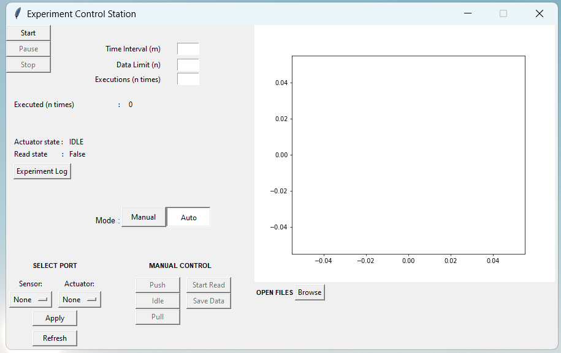

# lab-experiment-automation

## About The Project



This project is created to automize the repetitive experimental data collection, enhance the experiment time efficiency, reduce human manual intervention, and makes the experiment easier to customize. It utilizes communication between PC and multiple arduinos to manage sensors and actuator.

Brief explanation about the experiment:
* The goal is to measure the rate of peat burning. 
* It is being done by burning peat soil for a certain period of time while measuring the distance of the peat's subsidence periodically. 
* The distance is measured by IR Distance Sensors connected to arduino
* To minimize the high temperature damage when burning the peat, a linear actuator is being used to move the sensor to the heater only when it is the time to collect data

## Getting Started

### Prerequisites

* python
* tkinter
* pyserial
* pandas
* matplotlib

### Installation

Clone the repo
   ```sh
   git clone https://github.com/steffinatalie/lab-experiment-automation.git
   ```

### Run
Execute the main program
```sh
python main.py
```

## License

Distributed under the MIT License.
